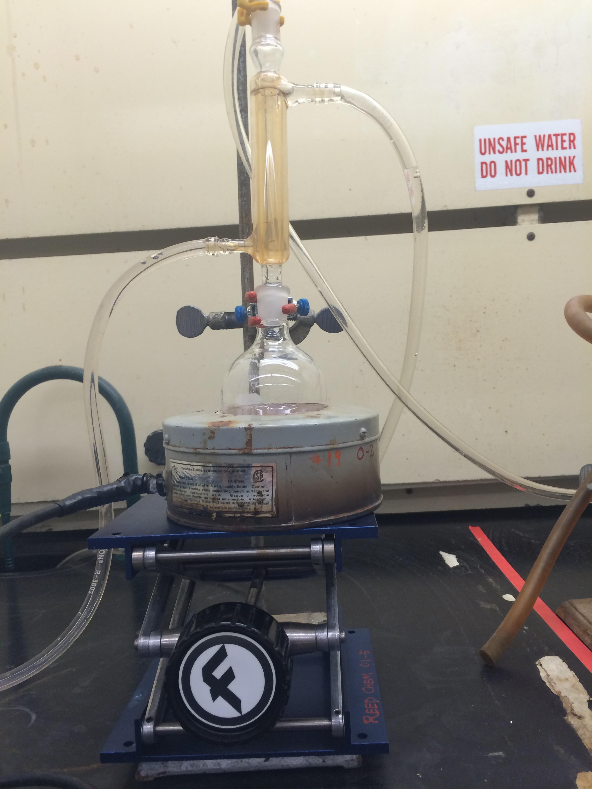

```{r, include=FALSE}
library(chemistr)
```

# Lab

## Abstract

Here you will provide a one-paragraph summary of the experiment.

## Methods

See appendix 5A for a sample for what the methods section of your lab report should look like.

## Results

The results section should include text describing your results and any figures or tables that you might like to include.  I have included example code for including two tables and a scatter plot as part of your results section. You may or may not want all of these.  

## Discussion

See appendix 3C and page 5.2 for information on how to write your discussion.

Example of writing an equation or molecular formula $H_2O + CO_2 \rightarrow H_2CO_3$

## Calculation

Here is where you put in either your calculations, using equations or inserting a picture of your calculations.  

For a good source of writing mathematical equation symbols, see <http://www.rpi.edu/dept/arc/training/latex/LaTeX_symbols.pdf>

Example:
$5M*5L=5 \text{ moles } Fe$

A figure can be inserted by using the following format, so long as the picture is saved in the same folder as the RMarkdown file.  NOTE:  You don't have the picture named below, so this markdown file won't knit until you either delete line 50 or change the picture to be a picture in your markdown folder.


```{r image, echo=FALSE, fig.cap="Insert Caption"}

```

\clearpage

```{r, echo=FALSE}
# Here is where you input your data that you want to put into a table
Iron <- c(0, 2.5, 5, 10, 20)
Absorbance <- c(0, 0.00316, 0.006, 0.012, .024)
# Places the columns next to each other in a data frame
iron_data <- data_frame(Iron, Absorbance)
```

```{r table, results="asis", echo=FALSE}
# Here is the code for creating a table
chem_table(iron_data, caption = "A lovely caption for the table")
```

```{r plot1, echo=FALSE, fig.cap="Insert Caption"}
# Here is where you create your standard curve.  Notice that we are again fitting the data to the line Y=mX+0.  In order to get the slope of your fit line, run all previous chenkc and this chunk and then type > summary(fit1) into your console.  This will give you the slope of your standard curve (Iron Estimate) as well as your uncertainty (Std. Error, NOT Residual Standard error) in the coefficients section of the summary.  Include the molar absorpitvity (with units) in your caption.
chem_scatter(data = iron_data, xvar = Iron, yvar = Absorbance, 
             xlab = "New Iron Label",
             ylab = "New Absorbance Label",
             intercept = 0)
fit1 <- lm(Absorbance ~ Iron + 0, data = iron_data)
```


```{r, echo=FALSE}
# Here is where you input your data that you want to put into another table, maybe of your results
Sample <- c("1 +/- .001")
Dilute1 <-c("10 +/- .01")
Dilute2 <- c("100 +/- 1")
Tablet <- c("1000 +/- 10")
# Place the columns next to each other in a data frame
dilute_data <- data_frame(Sample, Dilute2, Dilute1, Tablet)
#d <- rename(d, "New Sample" = Sample, "New Dilute" = Dilute2, "New Dilute 1 (mg/mL)" = Dilute1, "New Tablet (mg)" = Tablet)
```

```{r nice_table2, results='asis', echo=FALSE}
#kable(dilute_data, caption = "A lovely caption for the table")
```
