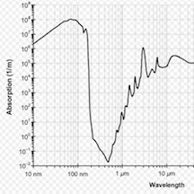
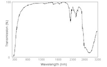
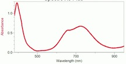
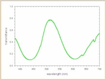

```{r setup, include=FALSE}
library(chemistr)
```

## Q1: What colors are found in a white light source?

```{r, echo=FALSE}
# Here is where you input your data for the white light source
Color <- c("Red", "Orange", "Yellow", "Green", "Blue", "Violet") 
WavelengthRange <- c("630-700", "590-630", "560-590", "490-560", "450-490", "400-450")
Q1_data <- data_frame(Color, WavelengthRange)
```

```{r table, results="asis", echo=FALSE}
# Here is the code for creating a table
chem_table(Q1_data, caption = "A lovely caption for the table")
```


## Q2:  Does water absorb visible light?

```{r echo=FALSE, fig.cap="Absorbance spectrum of $H_{2}O$ in a 1-cm cuvette."}

```

```{r echo=FALSE, fig.cap="Transmittance spectrum of $H_{2}O$ in a 1-cm cuvette."}

```


Answer to question should include:

1. Take-home message

2. Supporting data from figures and/or observations

Example

Water molecules do not interact with water.  This is based upon the fact that white light that transmits through the water still appears white to my eyes.  Also, the absorbance spectrum (figure 1) shows negligible amount of absorbance throughout the entire visible range and the transmittance spectrum (figure 2) shows almost 100% transmittance from 400-700 nm.


## Q3:  How can the color of $NiSO_{4}(aq)$ be expalined?

```{r echo=FALSE, fig.cap="Absorbance spectrum of 1 M $Ni(SO_{4})$ in a 1-cm cuvette."}

```

```{r echo=FALSE, fig.cap="Transmittance spectrum of 1 M $Ni(SO_{4})$ in a 1-cm cuvette."}

```

```{r echo=FALSE, fig.cap="Absorbance spectrum of 1M $NaSO_{4}$ in a 1-cm cuvette."}

```

Answer to question using the same guidelines as above.

$NiSO_{4}(aq)$ appears green in color due to $Ni^{2+}$ ions absorbing visible light.  This can be seen in three ways.  First of all, when white light shines through a 1 M sample, the color appears green to my eyes.  Second of all an absorbance spectrum shows that from ~400-450 nm and 600-700 nm most of the photons are not making it through the sample (figure 1).  Finally, the transmittance spectrum shows that mainly photons in the 450 nm - 600 nm region pass through the sample.  This transmittance range corresponds exactly to the green light range that was observed in question 1 (table 1). To show that this is not due to the water or the sulfate in solution, pure water and a sodium sulfate solution were also tested.  These samples showed no appreciable abosrbance in the visible range (figures 1 and 5) 
